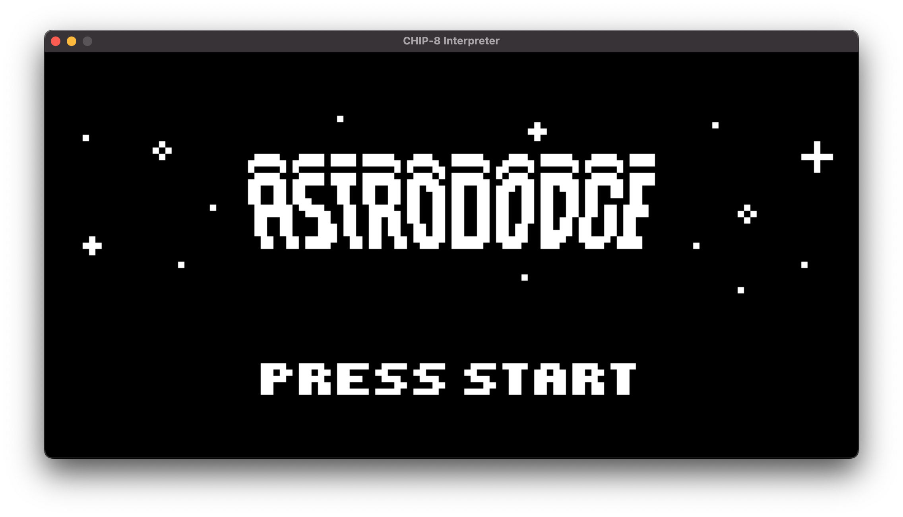

# CHIP-8 Interpreter

This is a CHIP-8 interpreter, written in Rust.



## Testing

Run all tests:

```sh
cargo test
```

## Usage

Build an executable:

```sh
cargo build --release
```

Run the emulator:

```sh
# CHIP-8
cargo run [ROM]

# Super CHIP
cargo run [ROM] true
```
